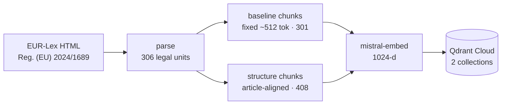
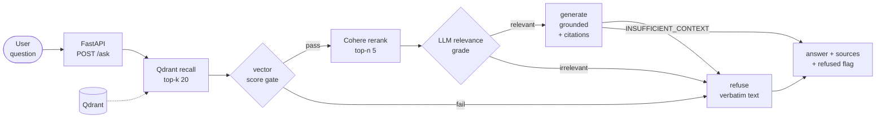

# EU AI Act QA Assistant

**A retrieval-augmented QA system over Regulation (EU) 2024/1689 — built to refuse rather than hallucinate.**

[](https://www.python.org/)
[](https://github.com/YN24601/RAG---AI-Act-Chatting/actions/workflows/sync-to-hf.yml)
[](https://yana24601-ai-act.hf.space)


Legal question answering has an asymmetric cost function: a fabricated article number is far worse than "I don't know." This project builds the full RAG lifecycle around that constraint — **structure-aware retrieval with article-level provenance, optional cross-encoder reranking, a two-stage relevance gate, deterministic refusal, and a measured evaluation loop** — on a cloud-first stack (Mistral · Qdrant · Cohere · Hugging Face).

- 🔗 **Live demo** — https://yana24601-ai-act.hf.space

---

## Highlights

- **Deterministic refusal.** A cheap score gate rejects out-of-scope questions *before* any LLM call; the answering model can only emit an `INSUFFICIENT_CONTEXT` sentinel, which a pure function maps to verbatim refusal text. Result: **100 % recall on 8 adversarial refusal traps, zero fabricated provisions.**
- **Structure-aware chunking.** The regulation is parsed into 306 hierarchical legal units, so every retrieved chunk carries its Article / Annex / Recital number and chapter — answers cite real provisions instead of anonymous text spans.
- **Auditable two-stage retrieval.** Qdrant recalls 20 candidates and optional Cohere `rerank-v4.0-pro` promotes the best five while preserving both vector and rerank scores. Obvious out-of-scope queries are rejected before the paid rerank call; transient reranker outages safely fall back to the measured vector baseline.
- **Controlled A/B evaluation.** Two chunking strategies scored on a hand-authored 45-question gold set with RAGAS plus custom refusal metrics, tracked as nested MLflow runs and persisted as a LangSmith dataset for regression testing.
- **Deployed, not just prototyped.** Multi-stage Docker image auto-synced to a Hugging Face Space through a **tokenless GitHub Actions OIDC pipeline**, with liveness/readiness probes and a non-leaking error contract.

## Architecture

**Indexing (offline, run once per corpus version)**



**Query path (runtime, LangGraph state machine)**



The runtime path (`recall → score gate → rerank → grade → generate | refuse`) is a **LangGraph** state machine; every node is traced to LangSmith. Transient Cohere failures (`timeout`, connection errors, `429`, `500`, `503`, `504`) degrade to vector-only ranking and are marked `rerank_status=fallback`; configuration/authentication failures remain HTTP 503. **An outage is never disguised as a refusal**, keeping `refused` trustworthy for evaluation and auditing.

## Quickstart

```bash
conda env create -f environment.yml
conda activate aiact-rag
cp .env.example .env                   # MISTRAL_API_KEY / QDRANT_URL / QDRANT_API_KEY / LANGSMITH_*
# Optional quality path: set RERANK_MODE=cohere and COHERE_API_KEY in .env

python scripts/run_ingestion.py        # fetch → parse → chunk
python scripts/build_index.py          # embed (Mistral) → index into Qdrant
python scripts/ask.py "What AI practices are prohibited?"   # full QA loop
pytest -q                              # 88 offline tests, no network required

PYTHONPATH=src uvicorn api.app:app --port 8000   # then open http://localhost:8000/
```

```bash
docker build -t aiact-rag .
docker run --rm -p 8000:7860 --env-file .env aiact-rag
curl localhost:8000/health             # {"status":"ok"}
```

> `PYTHONPATH=src` is required — the project is not installed as a package. Indexing must run once against your Qdrant instance before serving; the container is stateless by design.

### API

| Endpoint | Purpose |
| --- | --- |
| `POST /ask` | Full QA loop, including rerank status and dual-score source provenance |
| `POST /query` | Retrieval debugging; accepts optional `rerank: true/false` override |
| `GET /health` | Liveness; `?ready=1` also probes Qdrant reachability |
| `GET /` | Same-origin static front-end |

## Evaluation

45 hand-written questions with ground truth and article references — 37 answerable plus **8 refusal traps**: 4 out-of-scope (including a GDPR question, adjacent but not this regulation) and 4 fabrications (a non-existent `Article 200`, invented obligations, and `Article 4a` — real, but only in the Digital Omnibus amendments this corpus version deliberately excludes). RAGAS metrics are computed on the **answered subset** only; refusal metrics on the full set. Judge model is Mistral — same stack as production, not the OpenAI default.

| Metric | baseline | structure |
| --- | --- | --- |
| faithfulness | 0.940 | **0.975** |
| answer_relevancy | **0.962** | 0.956 |
| context_precision | **0.886** | 0.857 |
| context_recall | **0.914** | 0.801 |
| refusal_accuracy | 0.978 | **1.000** |
| refusal_recall | 1.000 | 1.000 |
| under-refusals (FN) | 0 | 0 |
| p95 latency answered / refused (s) | 4.15 / 1.93 | 3.83 / 1.09 |

Structure-aware chunking wins on **grounding** (faithfulness) and **refusal robustness**, but — contrary to the original hypothesis — **loses on RAGAS context precision/recall**: baseline's larger chunks drag in more surrounding text, which text-attribution metrics reward. This is recorded as measured rather than reframed.

```bash
python scripts/evaluate.py --strategy all --pause 0.6 --langsmith-upload
python scripts/evaluate.py --strategy all --rerank all --langsmith-upload
python scripts/evaluate.py --strategy structure --rerank all --enforce-rerank-gate
python scripts/evaluate.py --strategy "structure" --pause 0.6 --langsmith-upload
mlflow ui   # experiment "aiact-rag-eval": parent run + nested per-strategy runs
```

> These published numbers predate reranking and were computed before the harness was corrected to score only the exact `answer_hits` sent to generation. New `off`/`cohere` runs must therefore be compared with each other, not directly against this historical table. The evaluator also logs deterministic `candidate_recall@20`, `hit_rate@5`, `reference_recall@5`, `MRR@5`, and `nDCG@5` for structure-aware chunks.

## Project structure

```
data/raw/          Source HTML snapshot + fetch metadata (committed — corpus version lock)
data/eval/         eval_set.jsonl — 45-question gold set with refusal traps
src/ingestion/     schema · fetch · parse · chunk
src/retrieval/     config · embeddings · index · retriever · reranker (Qdrant + Mistral + Cohere)
src/generation/    config · llm · prompts · grade · graph · errors  (LangGraph + LangSmith)
src/api/           app · schemas · static/index.html            (FastAPI + same-origin UI)
src/evaluation/    schema · harness · aggregate · refusal · ragas_eval · tracking
scripts/           run_ingestion · build_index · query · ask · evaluate
tests/             88 offline pytest assertions + opt-in live Cohere smoke test
Dockerfile         Multi-stage build + HEALTHCHECK
```

## Tech stack

`Python 3.11` · `LangChain` / `LangGraph` · `Mistral` (mistral-embed, mistral-small) · `Qdrant Cloud` · `Cohere Rerank` · `FastAPI` · `Pydantic v2` · `Docker` · `RAGAS` · `MLflow` · `LangSmith` · `GitHub Actions (OIDC)` · `Hugging Face Spaces`

## Roadmap

- [x] Ingestion & preprocessing — HTML → 306 structured legal units → two chunking strategies
- [x] Embedding + Qdrant indexing + filtered vector retrieval
- [x] Cohere cross-encoder reranking with dual-score provenance and vector fallback
- [x] LangGraph orchestration + grounded generation + LangSmith tracing
- [x] FastAPI service + same-origin UI + multi-stage Docker + HF Space deployment *(verified live)*
- [x] RAGAS evaluation + refusal metrics + MLflow + LangSmith dataset
- [ ] Compliance layer — source attribution, PII handling, audit logging
- [ ] Polished demo

**Deliberately deferred**: hybrid dense+sparse retrieval, calibrated rerank-score filtering, paragraph-level citation granularity, auth/rate limiting, and a pytest CI gate.

## Corpus version & disclaimer

Built on the **OJ base text** of Regulation (EU) 2024/1689 (CELEX `32024R1689`, fetched 2026-06-06, sha256 recorded in `data/raw/fetch_metadata.json`). The **Digital Omnibus amendments are deliberately not included** — questions about them are expected to be refused, and one such trap (`Article 4a`) is part of the evaluation set.

> This is an engineering project, not a legal service. Outputs are AI-generated, may be incomplete or wrong, and **do not constitute legal advice**. Consult a qualified professional for compliance decisions.
